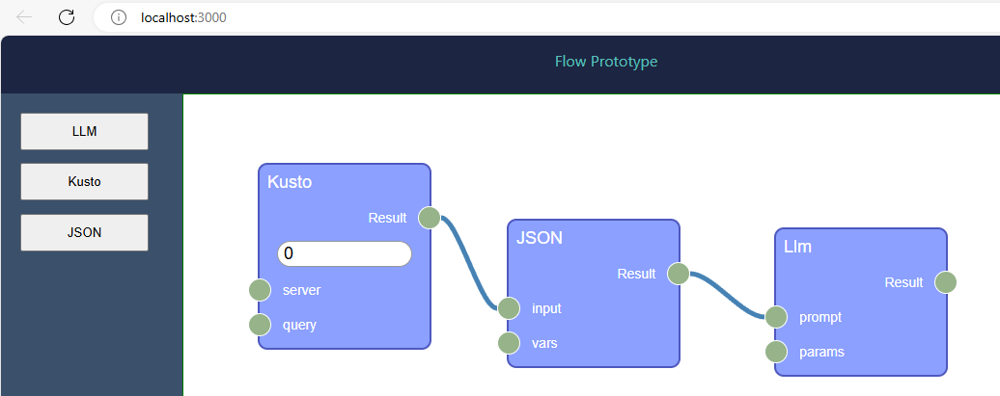

# Interactive Diagrams Prototype
Prototype/POC for using interactive diagrams to control workflows

## Running in dev mode
`npm start`

Runs the app in the development mode.\
Open [http://localhost:3000](http://localhost:3000) to view it in your browser.

The page will reload when you make changes.\
You may also see any lint errors in the console.

### Using the web app
If you go to localhost:3000, you get the default template, code at `default.ts`.

If you go to `localhost:3000/?template=customization` you will be running the code at `customization.ts`.

### Code tour
* NodeEditor - core of the editor. See example initialization in default.ts.

## Testing
`npm test`

Launches the test runner in the interactive watch mode.\
See the section about [running tests](https://facebook.github.io/create-react-app/docs/running-tests) for more information.

## Building
`npm run build`

Builds the app for production to the `build` folder.\
It correctly bundles React in production mode and optimizes the build for the best performance.

The build is minified and the filenames include the hashes.\
Your app is ready to be deployed!

See the section about [deployment](https://facebook.github.io/create-react-app/docs/deployment) for more information.

## How I created this
To get started I used [Rete Kit](https://retejs.org/docs/development/rete-kit).  I tried using `react-vite` but struggled to get that going (in particular I couldn't get it to launch successfully). So I just used plain `react`.

## Resources
* [Rete documentation](https://retejs.org/docs/guides/basic)
* [Rete react-plugin source (Github)](https://github.com/retejs/react-plugin)
* [Rete chatbot example](https://codesandbox.io/p/sandbox/retejs-v2-chatbot-programming-f6tcnw)

## Exploration
* See [chatbot example](https://codesandbox.io/p/sandbox/retejs-v2-chatbot-programming-f6tcnw).  Notice there are socket types, and socket type incompatibility. How do they do that?
    * see line 160 of editor.ts...
* This thing is big and convoluted. There's gotta be a better way.
    * [react-draggable](https://github.com/react-grid-layout/react-draggable)
    * [react-flow](https://reactflow.dev/) This looks maybe way more popular and actively maintained...
        * [React-flow examples](https://reactflow.dev/examples)